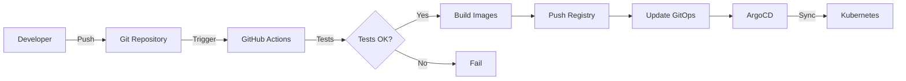

# 🎯 ArgoCD GitOps - Configuration complète

## ⚠️ AVANT DE COMMENCER

**Lisez ces fichiers dans l'ordre:**
1. 📖 [TODO_CONFIGURATION.md](TODO_CONFIGURATION.md) - Actions obligatoires
2. 🚀 [ARGOCD_QUICKSTART.md](ARGOCD_QUICKSTART.md) - Démarrage rapide (10 min)
3. 📚 [ARGOCD_DEPLOYMENT_GUIDE.md](ARGOCD_DEPLOYMENT_GUIDE.md) - Guide complet
4. 📝 [ARGOCD_MIGRATION_SUMMARY.md](ARGOCD_MIGRATION_SUMMARY.md) - Résumé de la migration

## 🗂️ Structure GitOps

```
.
├── argocd/                         # Applications ArgoCD
│   ├── appproject.yaml            # Projet avec RBAC
│   ├── application-dev.yaml       # App Dev (auto-sync)
│   ├── application-staging.yaml   # App Staging (auto-sync)
│   ├── application-prod.yaml      # App Prod (manual sync)
│   └── README.md
│
├── gitops/                        # Manifests Kubernetes
│   ├── base/                      # Configuration commune
│   │   ├── namespace.yaml
│   │   ├── configmap.yaml
│   │   ├── secrets.yaml          # ⚠️ À sécuriser!
│   │   ├── postgres.yaml
│   │   ├── backend.yaml
│   │   ├── frontend.yaml
│   │   ├── ingress.yaml
│   │   └── kustomization.yaml
│   │
│   ├── overlays/                  # Par environnement
│   │   ├── dev/
│   │   ├── staging/
│   │   └── prod/
│   │
│   └── README.md
│
├── .github/workflows/
│   └── ci-cd-argocd.yml          # Pipeline CI/CD
│
├── install-argocd.sh              # Installation ArgoCD
├── argocd-manage.sh               # Gestion quotidienne
│
└── Backend/api/views/
    └── HealthView.py              # Health checks K8s
```

## 🚀 Quick Start

### 1. Configurer le projet
```bash
# Éditer TODO_CONFIGURATION.md et compléter tous les points
nano TODO_CONFIGURATION.md
```

### 2. Installer ArgoCD
```bash
./install-argocd.sh
```

### 3. Déployer les applications
```bash
# Projet
kubectl apply -f argocd/appproject.yaml

# Applications
kubectl apply -f argocd/application-dev.yaml
kubectl apply -f argocd/application-staging.yaml
kubectl apply -f argocd/application-prod.yaml
```

### 4. Accéder à ArgoCD
```bash
# Port-forward
./argocd-manage.sh port-forward

# Ou ouvrir directement l'UI
./argocd-manage.sh ui
```

**URL:** https://localhost:8080  
**Username:** admin  
**Password:** `./argocd-manage.sh password`

## 📊 Workflow GitOps



## 🌍 Environnements

| Env       | Branch  | Namespace       | Replicas | Auto-sync | URL |
|-----------|---------|-----------------|----------|-----------|-----|
| Dev       | develop | app-kid-dev     | 1        | ✅        | dev.kid-livraison.local |
| Staging   | staging | app-kid-staging | 2        | ✅        | staging.kid-livraison.com |
| Prod      | main    | app-kid-prod    | 3        | ❌        | kid-livraison.com |

## 🛠️ Commandes utiles

```bash
# Gestion ArgoCD
./argocd-manage.sh status              # Status global
./argocd-manage.sh sync dev            # Synchroniser dev
./argocd-manage.sh logs prod           # Logs production
./argocd-manage.sh rollback staging    # Rollback staging
./argocd-manage.sh ui                  # Ouvrir UI

# Kubernetes
kubectl get applications -n argocd     # Lister apps
kubectl get pods -n app-kid-dev        # Pods dev
kubectl logs -f deployment/backend -n app-kid-dev

# Kustomize
kustomize build gitops/overlays/dev    # Voir manifests dev
```

## 🔐 Sécurité

### Secrets

**⚠️ CRITIQUE:** Fichier `gitops/base/secrets.yaml` contient des secrets par défaut!

**Solution:** Utiliser Sealed Secrets
```bash
# Installer
kubectl apply -f https://github.com/bitnami-labs/sealed-secrets/releases/download/v0.24.0/controller.yaml

# Créer secret chiffré
kubectl create secret generic postgres-secret \
  --from-literal=POSTGRES_PASSWORD="votre-password" \
  --dry-run=client -o yaml | \
  kubeseal -o yaml > gitops/base/postgres-sealed-secret.yaml
```

## 📚 Documentation

- **Actions obligatoires:** [TODO_CONFIGURATION.md](TODO_CONFIGURATION.md)
- **Quick Start:** [ARGOCD_QUICKSTART.md](ARGOCD_QUICKSTART.md)
- **Guide complet:** [ARGOCD_DEPLOYMENT_GUIDE.md](ARGOCD_DEPLOYMENT_GUIDE.md)
- **Résumé migration:** [ARGOCD_MIGRATION_SUMMARY.md](ARGOCD_MIGRATION_SUMMARY.md)

## 🆘 Troubleshooting

### Application OutOfSync
```bash
./argocd-manage.sh sync dev --force
```

### Pods ne démarrent pas
```bash
kubectl describe pod <pod-name> -n app-kid-dev
kubectl logs <pod-name> -n app-kid-dev
```

### ArgoCD inaccessible
```bash
kubectl get pods -n argocd
kubectl port-forward svc/argocd-server -n argocd 8080:443
```

## ✅ Checklist

- [ ] Lire TODO_CONFIGURATION.md
- [ ] Modifier URLs Git
- [ ] Modifier images Docker
- [ ] Configurer domaines
- [ ] Sécuriser secrets
- [ ] Installer ArgoCD
- [ ] Déployer applications
- [ ] Tester pipeline CI/CD

---

**Prêt pour le GitOps! 🚀**
