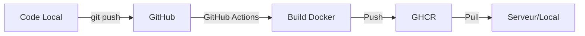

# 🚀 Synchronisation automatique avec GitHub

## 📋 Comment ça fonctionne

Quand vous poussez du code sur GitHub → GitHub Actions build automatiquement les images Docker → Images disponibles sur GitHub Container Registry

## 🔧 Configuration initiale (une seule fois)

### 1. Activer GitHub Container Registry

Les images seront stockées sur : `ghcr.io/yapka/kid-livraison/`

### 2. Rendre le registry public (optionnel)

Sur GitHub → Settings → Packages → `backend` et `frontend` → Change visibility → Public

### 3. Créer un Personal Access Token (pour pull les images)

1. Aller sur : https://github.com/settings/tokens/new
2. Nom : `kid-livraison-deploy`
3. Scope : cocher `read:packages`
4. Générer et **copier le token**

## 📦 Workflow automatique

```bash
# 1. Vous modifiez du code localement
vim Backend/api/views.py

# 2. Vous commitez et poussez
git add .
git commit -m "feat: nouvelle fonctionnalité"
git push github main

# 3. GitHub Actions build automatiquement (2-5 minutes)
# Voir le statut sur : https://github.com/yapka/kid-livraison/actions

# 4. Une fois terminé, déployez les nouvelles images
./deploy-from-github.sh main
```

## 🎯 Utilisation quotidienne

### Déployer la dernière version

```bash
chmod +x deploy-from-github.sh
./deploy-from-github.sh main        # Branche main
./deploy-from-github.sh develop     # Branche develop
```

### Tester localement avant de push

```bash
# Build et test en local
./test-local-complet.sh

# Si OK, push sur GitHub
git push github main
```

### Voir les images disponibles

```bash
# Sur GitHub
# https://github.com/yapka?tab=packages

# Ou avec Docker
docker search ghcr.io/yapka/kid-livraison
```

## 🔄 Workflow complet



## 📝 Fichiers créés

- `.github/workflows/docker-build.yml` : Workflow GitHub Actions
- `deploy-from-github.sh` : Script pour déployer depuis GitHub

## ⚙️ Variables d'environnement

Le workflow GitHub Actions utilise :
- `GITHUB_TOKEN` : Automatique (fourni par GitHub)
- Pas besoin de secrets supplémentaires !

## 🔍 Vérifier le build

```bash
# Voir les workflows
https://github.com/yapka/kid-livraison/actions

# Voir les packages
https://github.com/yapka?tab=packages

# Voir les tags disponibles
docker manifest inspect ghcr.io/yapka/kid-livraison/backend:main
```

## 🚨 Troubleshooting

### "Login failed"
```bash
# Vérifier que le token a le scope read:packages
# Créer un nouveau token : https://github.com/settings/tokens/new
```

### "Image not found"
```bash
# Attendre que le workflow GitHub Actions termine
# Vérifier sur : https://github.com/yapka/kid-livraison/actions
```

### "Permission denied"
```bash
# Rendre les images publiques sur GitHub
# Ou utiliser docker login avec votre token
```

## 🎓 Commandes utiles

```bash
# Pull manuel
docker pull ghcr.io/yapka/kid-livraison/backend:main
docker pull ghcr.io/yapka/kid-livraison/frontend:main

# Voir toutes les images
docker images | grep kid-livraison

# Nettoyer les anciennes images
docker image prune -a
```

## 🚀 Prochaines étapes

1. **Push le workflow sur GitHub**
   ```bash
   git add .github/workflows/docker-build.yml
   git commit -m "ci: add docker build workflow"
   git push github main
   ```

2. **Attendre le premier build** (2-5 min)
   Voir : https://github.com/yapka/kid-livraison/actions

3. **Déployer**
   ```bash
   ./deploy-from-github.sh main
   ```

Votre application est maintenant **automatiquement synchronisée** avec GitHub ! 🎉
